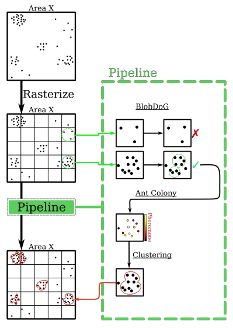
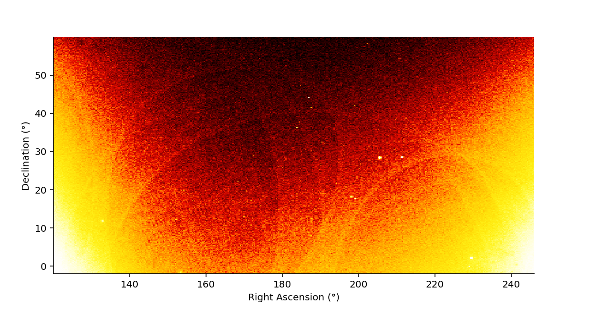
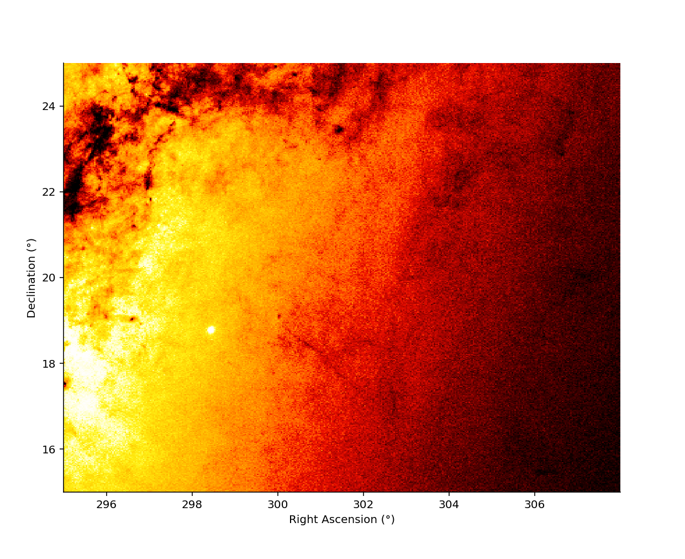
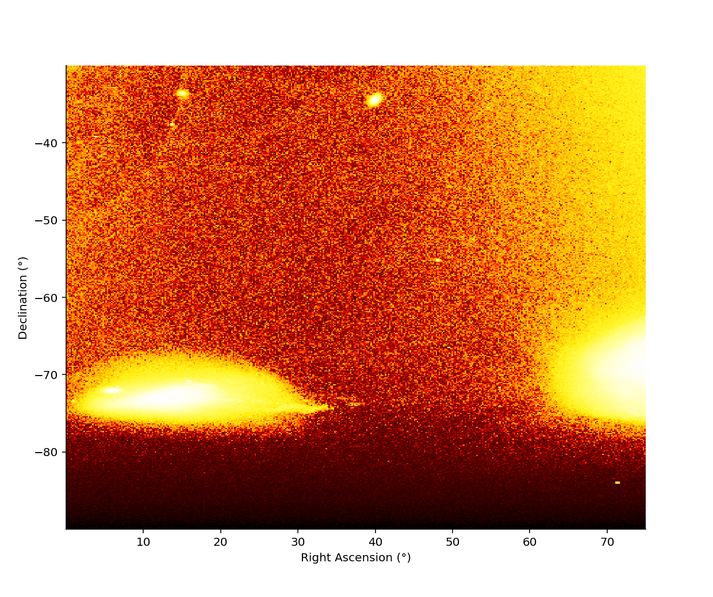
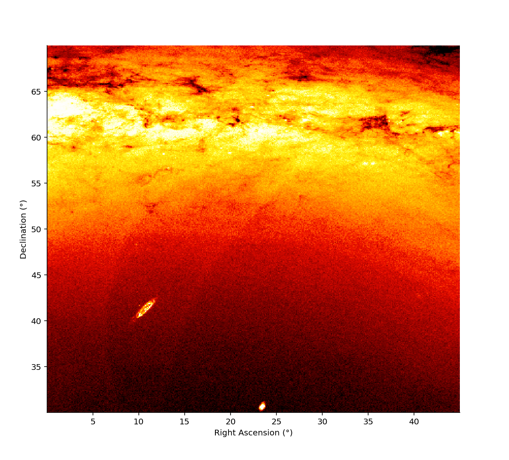

# Application of the Ant Colony Algorithm in the Identification of Globular Clusters 

This is an overview from my thesis for the BSc in AI at the University of Groningen. The full report is published in the faculty database:

| Item          | URI                                        |
|:--------------|:-------------------------------------------|
| report        | https://fse.studenttheses.ub.rug.nl/27086/1/final-submission-application-of-the-ant-colony-algorithm-in-the-identification-of-globular-clusters-j-hollander-s2956543.pdf |
| overview page | https://fse.studenttheses.ub.rug.nl/27086/ |

## Code

This project was originally written in Python. However, the estimated run time
for computing the results across all of the stellar rasters would have been
approximately two-weeks straight on Peregrine (the University super-computer).
By adding some optimizations and rewriting it in Julia and Rust I was able to
run on my local system overnight (in about 8 hours).

The different portions of the code-base relevant for the clustering pipeline
are as follows:

| Modules                                    | Location                                                                     |
|:-------------------------------------------|:-----------------------------------------------------------------------------|
| Rasterization                              | [`./src/rusty-hydra/src/bin/raster.rs`](src/rusty-hydra/src/bin/raster.rs)   |
| Ant Colony Algorithm                       | [`./src/jule-goliath/src/hydrangea.jl`](src/jule-goliath/src/hydrangea.jl)   |
| Gravity-based Clustering Algorithm         | [`./src/rusty-hydra/src/bin/cluster.rs`](src/rusty-hydra/src/bin/cluster.rs) |
| Interactive Pluto.jl notebook for plotting | [`./src/julia-plotting/plotting.jl`](src/julia-plotting/plotting.jl)         |

## Abstract:

Globular clusters (GCs) are stellar agglomerates of about 10 000 to 100 000 stars. They provide
an interesting ground to study stellar evolution. The complexity of the Universe makes the precise
identification and classification of stellar structures challenging. In this paper, a pipeline for the
identification of GCs is developed based on work by M. Mohammadi et al.[^1] This pipeline consists of
excluding candidate regions through the use of a blob-detection technique. The remaining regions
are then processed by the Ant Colony random-walk algorithm. This algorithm investigates a region
and provides information on its stellar density in the form of pheromone values. Finally, these results
are fed into a gravity-inspired clustering algorithm that was developed to interpret the pheromone
values to determine potential GCs.

The aim of the research is to determine the accuracy of the pipeline in classifying GCs and
investigate possible improvements. This pipeline is then applied on the Gaia DR2 data-set. Different
areas consisting of a variety of stellar objects are selected. Some of these areas contain known GCs
(Area 1, 2, and 3), while some do not. Each of these areas is split via a rasterization process into
evenly distributed rasters. The accuracy of the pipeline is explored by running it on these different
rasters and considering firstly if it finds all known GCs and secondly by considering what other
stellar structures it classifies as GCs.
For the blob-detection technique a cutoff point for the constant representing the minimal accept-
able blob size was identified to be 0.2. Under this cutoff point the blob-detection technique filters
away 87.5 % (813 out of 929) of the candidate rasters and maintains 76.9 % (20 of the 26) rasters
that contain known GCs. For the three areas containing known GCs this is:

- Area 1: 7 out of 12 rasters containing GCs
- Area 2: 1 out of 1 rasters containing GCs
- Area 3: 16 out of 17 rasters containing GCs

The Ant Colony algorithm coupled with the clustering algorithm applied across the same rasters
leads to varying results per execution. Across 5 experiments, an average of 51 ± 4 clusters are found.
The combined results over all experiments show that the clustering maintains 43.3 % (13 out of 30)
of the known GCs:

- Area 1: 7 out of 12 GCs
- Area 2: 1 out of 1 GCs
- Area 3: 5 out of 17 GCs
 
The results of the full pipeline identifies 41 clusters of which 27 could be identified as known stellar
structures. These clusters are (31.7 %) 13 GCs, (12.2 %) 5 Open Clusters, (9.8 %) 4 Galaxies, (4.9 %)
2 Dwarf Galaxies, (2.4 %) a Molecular Cloud, (2.4 %) an Absorption Nebula, and (2.4 %) an Emission
Nebula. In addition, it finds (34.1 %) 14 clusters that do not correspond to a known stellar structure.
For Areas 1, 3, and 4 most of the clusters are found consistently across the experiments. However,
in Area 2 the clusters are only found sporadically, with each cluster being found only in at most two
experiments.

It is evident from these results that the blob-detection operates as an effective exclusion criteria
but with the current constant it does not yet maintain all known GCs. While the pipeline does not
identify the majority of the GCs that exist, for those that it is able to identify, it can pinpoint their
locations accurately. Further research in tuning the parameters and steering the behavior of the ants
is expected to expand the number of GCs identified by the pipeline and to solidify the Ant Colony
as a useful tool for exploring the Universe. With further refinement of the process and the synergy
of the initial blob filtration and clustering applied on the Ant Colony pheromones, this pipeline can
likely be made robust.

## Data

The stellar data selected for this project is a subset of the Gaia DR2 data-set [^2]. This data,
collected during the Gaia satellite mission, is approximately 500 GB and consists of a variety
of parameters collected on a per-star basis. This is in great contrast with typical telescopic data
which is primarily raw radiometric imagery and greatly expands the types of processing that may be
conveniently applied. The subset of the parameters that are of interest to the pipeline are described
in Section 2.1. As a result of hardware constraints, the investigation has been limited to a set
of smaller regions from within the Gaia data-set. Four distinct areas were selected, bounded by
by right ascension (RA) × declination (Dec), and represent regions of interest with varying stellar
distributions. The following sets out the cosmic ranges as well as the number of stars within these
areas.

| Area | RA              | Dec             | Number of Stars |
|:-----|:----------------|:----------------|:---------------:|
| A1   | 120° up to 246° | −2° up to 60°   | 25 486 556      |
| A2   | 295° up to 308° | 15° up to 25°   | 23 470 239      |
| A3   | 0° up to 75°    | −90° up to −30° | 16 781 316      |
| A4   | 0° up to 45°    | 30° up to 70°   | 32 333 936      |

A visual representation of the stellar distribution for the four areas may be seen in the following figures:

-----

*Stellar Distribution Heat-map for Area 1*
<figure>
  
</figure> 

*Stellar Distribution Heat-map for Area 2*
<figure>
  
</figure> 

*Stellar Distribution Heat-map for Area 3*
<figure>
  
</figure> 

*Stellar Distribution Heat-map for Area 4*
<figure>
  
</figure> 

-----

These four areas are rasterized into much smaller sections and then the BlobDoG,
Ant Colony, and Gravitational Clustering algorithms are then applied in parallel
across each raster.

[^1]: M. Mohammadi, N. Petkov, K. Bunte, R. Peletier, and F.M. Schleif, "Globular Cluster Detection in the Gaia Survey," Neurocomputing, vol. 342, pp. 164–171, 2019

[^2]: Gaia Collaboration et al., "Gaia Data Release 2 - Summary of the Contents and Survey Properties," Astronomy and Astrophysics, vol. 616, Aug. 2018. doi: 10.1051/0004-6361/201833051. [Online]. Available: https://doi.org/10.1051/0004-6361/201833051.
